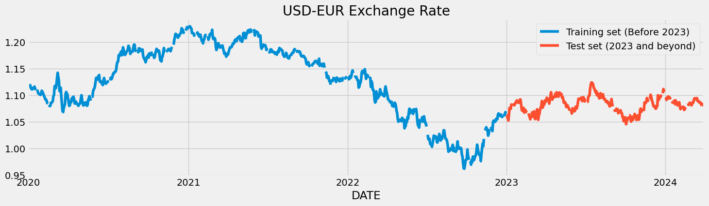
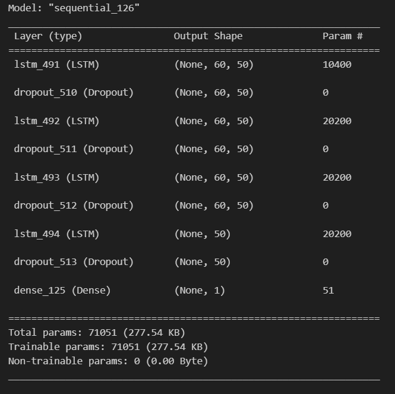
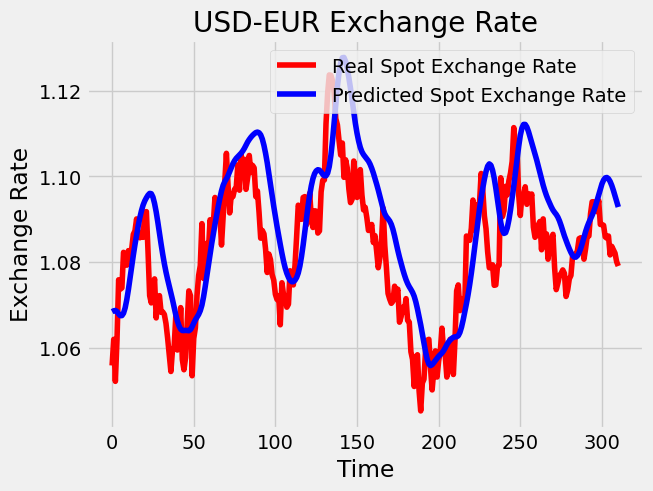
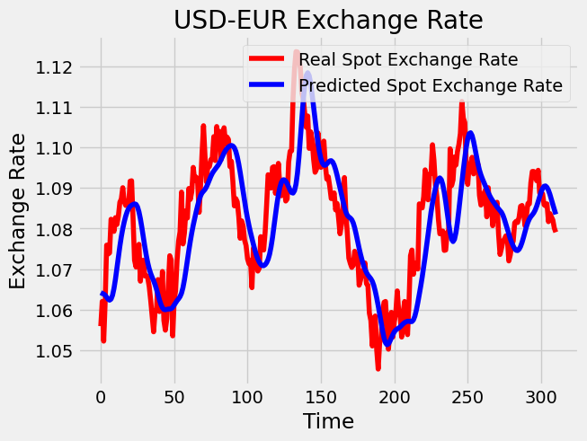
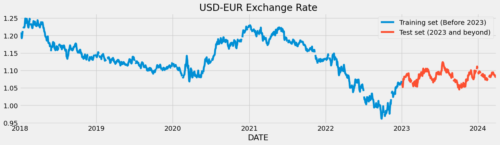
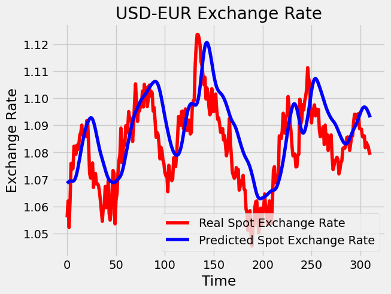
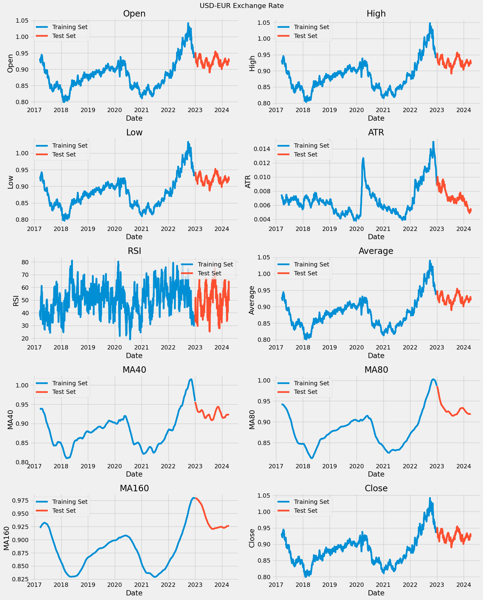
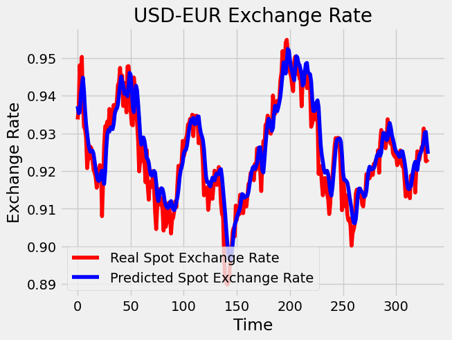

# ChangeLog

## Changes

### Project Goals
 This project was inspired and guided by a Jupyter notebook which explores the use of Recurrent Neural Networks for time series prediction. This notebook explores both Long Short Term Memory (LSTM) and Gated Recurrent Unit (GRU) neural networks. The goal of that project is to predict IBM stock prices and can be found [here](https://www.kaggle.com/code/thebrownviking20/intro-to-recurrent-neural-networks-lstm-gru) for credit to the author and reference for those interested.
  The project adapts that code with the new goal of using an LSTM model to predict Forex exchanges rates in particular from USD to Euros. 

### Data Source
<p> The source notebook does not use a set dataset but instead using webscraping library such as pandas_datareader to import the data straight from the internet. The data sources used are: 

1. **Federal Reserve Economic Data**
    - **Description**: This data source is the Federal Reserve Economic Data (FRED) which is webscraped using the pandas_datareader library. The data being imported is the US Dollars to Euro Exchange Rate (DEXUSEU).
    - **Usage**: This dataset will be used to develop a Neural Network which will attempt to use the data to predict future values of the exchange.
    - **Source Quality**: This dataset was sourced from FRED which is a trusted source for economic data.

2. **Yahoo Finance**
    - **Description**: The yFinance library is employed to fetch historical currency exchange rate data from Yahoo Finance. The data retrieved is the US Dollars (USD) to Euro (EUR) exchange rate but with additional feature such as High, Low and Opening Prices for each day.
    - **Usage**:  This dataset serves as an alternative source of historical exchange rate data and will be utilized for developing a predictive model to forecast future USD to EUR exchange rates.
    - **Source Quality**: Yahoo Finance is a widely used platform for accessing financial market data, and yFinance is a reliable Python library for fetching this data, thus ensuring the quality and reliability of the dataset.

2. **pandas_ta Library**
    - **Description**: The pandas_ta library is utilized to compute various technical analysis indicators, including the Moving Average (MA60), Relative Strength Index (RSI), and others, directly from the imported exchange rate data.
    - **Usage**:  These TA indicators serve to add additional data about price movements and market sentiment of the USD to EUR exchange rate. These will be used to allow models to learn more complex patterns into possible trends in the exchange rate values.
    - **Source Quality**:  The pandas_ta library is widely used in financial analysis and is known for its accuracy and reliability in computing TA indicators.

### Data Exploration
<p> As this project is using a different dataset with webscraped dat, some data exploration and preprocessing is required to make sure the data is clean and ready for modelling. The first steps in data exploration was to perform preliminary data exploration to understand the dataset and its features. For the first model, data on the spot USD to Euro exchange rate was imported with a date range from 2020 to the current date with the code below:

```
tickers = ['DEXUSEU']
data_source = 'fred'
end_date = datetime.date.today()
df = web.DataReader(tickers, data_source,'2020-01-01', datetime.date.today())
```

In this data, there are 1048 rows of the spot exchange rate, representing 1048 different day rates from 2020 to the current date. 



Visualising these totals on a graph we can how the rate has flucated over time with the highest exchange rate occuring at the start of 2021 and the lowest being the end of 2022.<br><br>

### Data Pre-processing

#### Data Cleaning

The next change in data exploration was to check if the dataset needs any cleaning. The usual steps were taken to find any rows with null values. For this dataset, 48 rows with null values were found and removed.

#### Split training and test sets
The start of 2023 marks the split between the training and test sets with all data before that date used for training and all data after that date used as the test set. This works out as a roughly 70/30 split with 749 rows in the training set and 311 in the test set. This split and is done with the following code.

```
training_set = df[:'2022'].iloc[:,0:1].values
test_set = df['2023':].iloc[:,0:1].values
```

#### Normalise data
As there is a single numeric column, no data transformation were required but the value in the column is normalised even though this is not technically required as there is only one column. This was done because the plan is to add more features in later models so to test the code for later modelling. Minor changes were made to the code from the reference notebook here to get the code to work for this project's different dataset structure.

```
sc = MinMaxScaler()
training_set_scaled = sc.fit_transform(training_set)
```

#### Structure training data for LSTM
For training an LSTM a sequences of time variant data in created using 60 previous times steps and their values. These sets of time periods are then used to train the model. In the code below we modify the code from the reference notebook to work with our dataset structure and set the range to start at 60 for the first set of values obtained by i-60.

```
X_train = []
y_train = []
for i in range(60,749):
    X_train.append(training_set_scaled[i-60:i,0])
    y_train.append(training_set_scaled[i,0])
X_train, y_train = np.array(X_train), np.array(y_train)
```

### Model Creation

#### Model 1
For the first model we will use the LSTM from the notebook to get an idea of its current performance on this task.<br>
Evaluating this model we can see its structure:<br>
1. Input Layer
- The input layer also serves as a processing layer
- This is a LSTM layer with 50 neurons (units) designed to process sequential data
- return_sequences is True which means this layer will output hidden states for each timestep which lower layers can access
2. Hidden Layers
- The model has four dropout layers to randomly drop data to prevent overfitting.
- The model has 3 further LSTM layers with 50 neurons with the last having return_sequence set to false by default
3. Output Layer
- The model has an output layer which will output a single continous value
4. Configuration
- The model uses the rmsprop optimiser
- The loss function is mean_squared_error as this is a Regression task



##### Model 1 Evaluation

As this is a Regression task, mean_squared_error is used instead of accuracy to assess model performance.<br>
Model 1 performed very quite well with this task. We have a mean squared error of only 0.012 which given our dataset is normalised between 0 and 1 is a fairly good result. We can see that while the predicted values do not conform to small variations in the dataset, the line created does roughly follow the actual values quite well, especially when we consider the limited dataset used so far for Model 1's training.



#### Model 2
We saw that Model 1 was not conforming to small variations in the actual values so for Model 2, we add neurons and a fifth LSTM layer to enable the model to learn deeper complexities in the patterns in an to attempt to see if we can get a better fit. The model is switched to the Adam optimiser because although more computationally expensive, it can speed up convergence which may improve out learning rate. <br>
Note: A test run with an increased dropout to 0.3 did not improve results so overfitting to the dataset does not seem to be the issue preventing better results, perhaps underfitting is more likely given the limited dataset. 
The code to create Model 2 can be seen below:

```
regressor = Sequential()
regressor.add(LSTM(units=100, return_sequences=True, input_shape=(X_train.shape[1],1)))
regressor.add(Dropout(0.2))
regressor.add(LSTM(units=100, return_sequences=True))
regressor.add(Dropout(0.2))
regressor.add(LSTM(units=100, return_sequences=True))
regressor.add(Dropout(0.2))
regressor.add(LSTM(units=100, return_sequences=True))
regressor.add(Dropout(0.2))
regressor.add(LSTM(units=100))
regressor.add(Dropout(0.2))
regressor.add(Dense(units=1))

# Compiling the RNN
regressor.compile(optimizer='Adam',loss='mean_squared_error')
# Fitting to the training set
regressor.fit(X_train,y_train,epochs=50,batch_size=32)
```

##### Model 2 Evalutaion
This Model performs almost identically to Model 1 with a MSE of .0099 meaning adding complexity had practically no benefit in this case. This is probably because the dataset being used is small so there is not enough data for a more complex model to increase its performance.<br>
Another interesting observation is that the model predictions from both Model 1 and Model 2 seem to be offset from the true values. This may indicate that the model is learning to simply predict the previous value in the time series and is actually not learning the pattern at all. For the next attempt I will increase the dataset size and see if this improves this issue.<br>
On the graph below we can see how closely the model prediction are fitting with actual values.




#### Model 3
For Model 3 no changes will be made to the dataset but instead the dataset will be extended to include dates from 2018 onwards to see if giving the model access too additional instances of the exchange rate fluctuations will increase model performance. This additional data was obtained by webscaping additional data from the FRED data source using the code below.

```
tickers = ['DEXUSEU']
end_date = datetime.date.today()
df_extended = web.DataReader(tickers, 'fred','2018-01-01', datetime.date.today())
total_rows = df_extended.count()
```

The graph below gives a visualisation of this extra data now spanning back to 2018.



The new extended dataset was cleaned and split into training and test sets in the same manner as the previous dataset.

##### Model 3 Evaluation
Model 3 shows no improvement when given more instances of the same data. This is not really surprising as it seems clear now from studying the graphs of the model performance, that the model is learning to simply predict the previous value as once again the prediction is just the real spot prices shifted forward. The next steps will be to try to add more indicators from which the model can learn. Upon reflection predicting a Forex price in a vacuum is probably impossible given that its pattern is controlled by external factors more than having a particular pattern a model can learn.



#### Model 4
For the next model, we will attempt to include some external indicators that could indicate market sentiment and thus give the model more data on how the exchange rate may change. Credit to Paul Bacher's guide found here for these indicators: https://www.kaggle.com/code/paulbacher/forex-trend-predictions-classic-ml-approach

##### New Feature vector
For the new feature vector, Yahoo Finance is used to gain more data on the fluctuations of the exchange rate with additional data on Opening and Closing exchange rate and the daily High and Low values for the rate.<br>
Pandas_ta library is then used to calculate a number of Technical indicators from the data including Moving Averages and relative strength of buying and selling of the currencies. This new dataset is webscraped using the code below:

```
dfn = yf.download(tickers='USDEUR=X',
                 period='2000d',
                 interval='1d')
dfn= dfn.drop(['Volume', 'Adj Close'], axis=1)
dfn['ATR'] = dfn.ta.atr(length=20)
dfn['RSI'] = dfn.ta.rsi()
dfn['Average'] = dfn.ta.midprice(length=1)
dfn['MA40'] = dfn.ta.sma(length=40)
dfn['MA80'] = dfn.ta.sma(length=80)
dfn['MA160'] = dfn.ta.sma(length=160)

```
The lengths here are the number of days used in the calculation of the various metrics.<br>

Added Indicator Descriptions
1. ATR (Average True Range): Measures market volatility by calculating the average range between the high and low prices over a specified period (in this case, 20 days).
2. RSI (Relative Strength Index): Indicates the magnitude of recent price changes to evaluate whether a stock is overbought or oversold, typically over a 14-day period by default.
3. Average: Calculates the average price between the high and low prices for each day, providing a reference point for market activity over a one-day period.
4. MA40 (40-day Moving Average): Smooths out price data by calculating the average closing price over the past 40 days, providing insight into the overall trend direction.
5. MA80 (80-day Moving Average): Similar to MA40 but calculates the average closing price over the past 80 days, offering a longer-term perspective on the trend direction.
6. MA160 (160-day Moving Average): Computes the average closing price over the past 160 days, providing an even longer-term view of the trend direction and smoothing out short-term fluctuations.

##### Data Exploration
We can see that these features have a clear covariance which is to be expected given that the columns such as MA60 are just moving averages of the exchange rate figures. RSI is the only column which is not tightly coupled but instead jumps around which again is understandable as it is a sentiment metric measuring strength of stock market buying. The covariance of all the related columns may cause the model to overfit to a pattern which we may have to consider in model evaluation.




##### Model 4 Evaluation
We can see that the additional data and indicators have led to a large increase in Model performance with the predicted data conforming much better to the actual values. The predicted values do not seem to be just the previous value shifted forward anymore and there is additional conformity to smaller variations. The visual improvement is also seen in the MSE which has reduced considerable to .0050.



## Learning Outcomes

1. **Configuration of LSTMs**
Through the project, I gained experience in configuring Long Short-Term Memory (LSTM) neural networks, including the number of units, understanding the implications of setting return sequences, and defining appropriate input shapes based on the sequential nature of the time series data.

2. **Structuring Input Time Series Data into Recurrent Neural Networks**
Working with the USD to Euro exchange rate data allowed me to develop skills in structuring input time series data into Recurrent Neural Networks (RNNs), specifically LSTMs. This involved learning how to format the data into batches of previous time periods to allow the model to gain insight into the time series patterns.

3. **Dealing with Time Series Data and Predictive Patterns**
 In the process of predicting the USD to Euro exchange rate, I learned about the challenges inherent in working with time series data, such as the risk of models simply predicting the previous value.

4. **Importance of Technical Indicators in Financial Prediction**
 This project was my first attempt at using machine learning to model financial data and through this project, I gained an appreciation for the importance of incorporating technical indicators in financial trend prediction models. Utilizing indicators like MA and RSI allow the model to learn more complex patterns in how external factors and longer moving trends relate to what direction a particular financial value is lightly to shift over time.